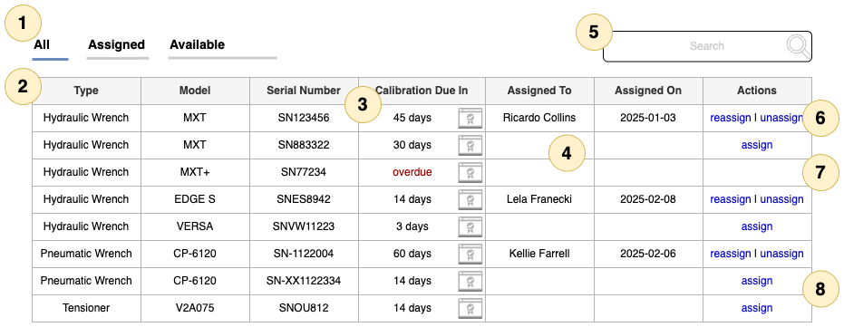
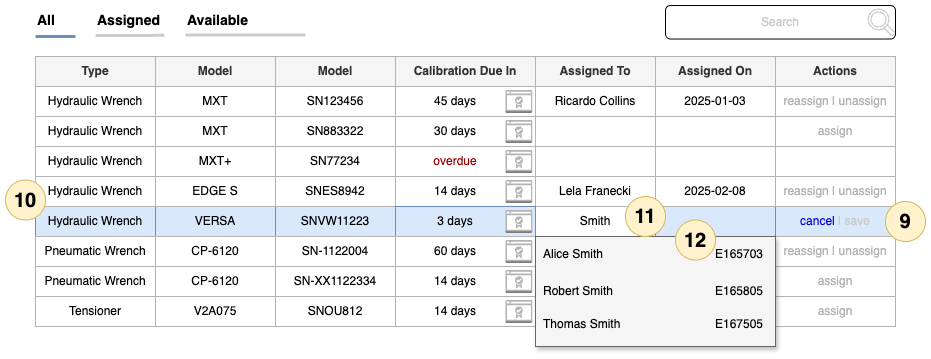

# Overview

The inventory table is a component that displays a list of tools in the company inventory for tracking which worker is using which tool.

Each tool has a type, a model number, a serial number, and a calibration certificate that verifies the tool's calibration.

This component is intended to be used as part of a simple inventory management system, where a supervisor can assign tools to workers.

# Requirement Overview

## Displaying the data

| No.   | Requirement           | Description                                                                        |
|-------|-----------------------|------------------------------------------------------------------------------------|
| **1** | Quick Filters         | Pre-configured filters for the table to hide rows by assignment status.            |
| **2** | Tool Data             | Tool row                                                                           |
| **3** | Calibration Data      | Calibration expiration is shown along with an icon to download the PDF certificate |
| **4** | Assignment Details    | The worker's name and date of assignment are shown or its empty if unassigned.     |
| **5** | Search box (optional) | Only shows rows that match the search terms                                        |
| **6** | Reassign / Unassign   | If a tool is assigned, it can be reassigned or unassigned.                         |
| **7** | No actions            | If a tool's calibration is expired, it cannot be assigned.                         |
| **8** | Assignment            | If a tool is not assigned and has a valid calibration, it can be assigned.         |

### Requirement Details

| No.     | Requirement                                                                                                       |
|---------|-------------------------------------------------------------------------------------------------------------------|
| **1.1** | Use a bold font for the filters                                                                                   |
| **1.2** | Show a divider line under each option                                                                             |
| **1.3** | The selected filter should have a colored divider while the unselected filters have a divider                     |
| **1.4** | All is the default and shows all the data                                                                         |
| **1.5** | Assigned only shows tools that are assigned                                                                       |
| **1.6** | Available shows all tools that are unassigned                                                                     |
| -----   |                                                                                                                   |
| **2.1** | Display each value for a tool in the corresponding column                                                         |
| -----   |                                                                                                                   |
| **3.1** | Use a library like `moment` to display the relative number of days until the tool calibration expiration          |
| **3.2** | Provide a clickable icon to download the tool's calibration certificate which is typically a PDF                  |
| **3.3** | If a tool's calibration is expired, display `overdue` in red                                                      |
| -----   |                                                                                                                   |
| **4.1** | A tool assigned to a user includes the user's name and employee number                                            |
| **4.2** | Display the user's name in the `Assigned To` column when assigned                                                 |
| **4.3** | Provide a hover text on the user's name to display their employee number                                          |
| **4.4** | If assigned, display the date of the assignment                                                                   |
| -----   |                                                                                                                   |
| **5.1** | This is an optional requirement. See the inventory-api.ts on where to add the search function                     |
| **5.2** | Search box should have placeholder text of `Search`                                                               |
| **5.3** | Any search text is only against the currently applied filter of All/Assigned/Available                            |
| **5.4** | Search against each of the tool fields and the assigned user name and employee number                             |
| **5.5** | The search is not case sensitive                                                                                  |
| **5.6** | Assume that the payload from the server is the entire inventory with assignments. At most you'll have 500 records |
| -----   |                                                                                                                   |
| **6.1** | Provide links to reassign or unassign a tool                                                                      |
| **6.2** | Reassigning a tool displays the same edit control as shown below for the assign                                   |
| **6.3** | Unassigning a tool should display a confirm dialog and if confirmed, remove the assignment                        |
| **6.4** | Tools with expired calibrations cannot be reassigned or assigned                                                  |
| -----   |                                                                                                                   |
| **7.1** | An unassigned tool with an expired calibration cannot be assigned                                                 |
| -----   |                                                                                                                   |
| **8.1** | An unassigned tool can be assigned if it has a valid calibration                                                  |

## Assigning a tool

| No.    | Requirement         | Description                                                                                                                        |
|--------|---------------------|------------------------------------------------------------------------------------------------------------------------------------|
| **9**  | Editable row        | When clicking assign or re-assign, an edit session begins for the tool which must be saved or canceled before making other changes |
| **10** | Highlight           | The tool row that is being edited has a highlight around its borders                                                               |
| **11** | Assigned To Input   | Displays an input editor with a dropdown showing matches as you type                                                               |
| **12** | Matched Workers     | The menu displays the workers matched by the input in the Assigned To editor. Match on names and employee numbers.                 |

### Requirement Details

| No.      | Requirement                                                                                                                  |
|----------|------------------------------------------------------------------------------------------------------------------------------|
| **9.1**  | See the Ant Design Table for an example of a table component that supports editable rows.                                    |
| **9.2**  | The only editable cell is the Assigned To.                                                                                   |
| **9.3**  | The Assigned On is set to today's date. (For extra credit, allow editing of this w/ a calendar picker).                      |
| **9.4**  | Upon entering the edit session, the actions for the other rows are disabled and render in a muted color.                     |
| **9.5**  | The initial state of the edit session only has `cancel` enabled. The `save` is only enabled when the user makes a selection. |
| -----    |                                                                                                                              |
| **10.1** | The highlighted row should be clearly indicated.                                                                             |
| -----    |                                                                                                                              |
| **11.1** | The pic shows the user typed "Smith" which matched on 3 names in the employee directory.                                     |
| **11.2** | The admin can also enter the employee number.                                                                                |
| **11.3** | Hitting enter while there is a single match in the menu selects that item and closes the menu.                               |
| -----    |                                                                                                                              |
| **12.1** | The menu appears with matches after the user starts typing in the cell editor.                                               |
| **12.2** | Display the matched employee name aligned left and their employee number aligned right.                                      |
| **12.3** | Allow the menu to grow to a height to display 3 names with a scroll bar if there are more matches.                           |

## Provided Code

| File                       | Description                                                            |
|----------------------------|------------------------------------------------------------------------|
| src/inventory-api.ts       | A mock API for the inventory system                                    |
| src/data/employees.json    | A sample file of employees to feed to the mock system                  |
| src/data/tools.json        | A sample file of tools to feed to the mock system                      |
| test/inventory-api.test.ts | Unit test for the public methods on the API to illustrate how it works |
| test/sample-data.test.ts   | A script (packaged as a test) to recreate the sample data files        |

### Inventory API

The mock system provides methods to get the tools and employees, as well as methods to
assign and unassign tools to employees. The API is designed to be simple and easy to use,
with a focus on the requirements outlined above.

The constructor accepts an optional delay parameter to simulate network latency and each
of the methods returns a Promise that resolves to the data.

None of the methods that read or write data to the API will throw an error. Methods that mutate data
return an `AssignmentResult` object that contains a boolean `ok` property to indicate success or failure.

You should use the provided class and sample data files in lieu of writing your own API or mocking any live
endpoints. Details like the use of an HTTP client or authentication tokens are not part of this exercise.
